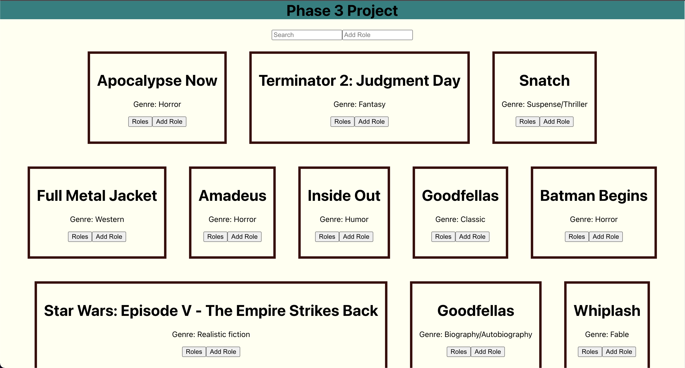

# Phase 3 Project Backend

## Description

- This application displays a list of movie tiles to the user. These movie tiles contain information about the movie such as genre and any roles that it may have. There are features that will allow a user to display, edit, delete, or add roles to an individual movie.
- 

## Usage
- This project was created to supply a functional API with multiple routes for a React front end application.

## Project Status
- This project is no longer being developed. 

## Installation

- Ruby - Check to see if you have an up-to-date version of Ruby by running:
  ```bash
  ruby -v
  ```
  If you need to install Ruby click the link below:
    [Ruby Install](https://www.ruby-lang.org/en/documentation/installation/)

#### Required Gems
- gem "activerecord", "~> 6.1"
- gem "sinatra-activerecord", "~> 2.0"
- gem "rack-cors", "~> 1.1"
- gem "sinatra", "~> 2.1"

These and more Gems can be found by following this link: [Ruby Gems](https://rubygems.org)

## Contributing
- This project is open to interested contributors. 
- There are no explicit variables that need to be taken into account aside from the required gems and environment setup listed above.

## Support
- This project is no longer under development and is no longer maintained - There are no support resources.


## Resources

- [create-react-app][]
- [dbdiagram.io][]
- [Postman][postman download]

[create-react-app]: https://create-react-app.dev/docs/getting-started
[create repo]: https://docs.github.com/en/get-started/quickstart/create-a-repo
[dbdiagram.io]: https://dbdiagram.io/
[postman download]: https://www.postman.com/downloads/
[network tab]: https://developer.chrome.com/docs/devtools/network/
